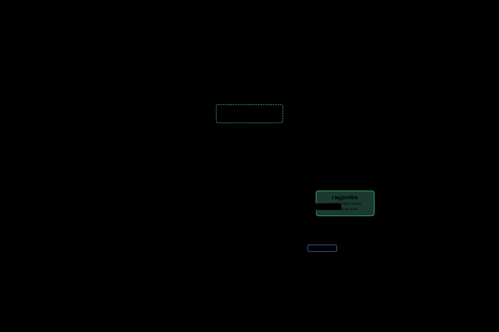

# RAG Suite

A modular, corpus-preferring RAG stack. Documents go in, grounded answers come out, hallucinations get caught.

## Components

| Repo | What it does | Status |
|------|-------------|--------|
| [ragpipe](https://github.com/aclater/ragpipe) | RAG proxy — semantic routing, retrieval, reranking, citation validation, grounding classification | Production |
| [ragstuffer](https://github.com/aclater/ragstuffer) | Document ingestion — polls Google Drive, git repos, and web URLs; extracts, chunks, embeds, indexes | Production |
| [ragprobe](https://github.com/aclater/ragprobe) | Adversarial testing + Ragas evaluation — 66+ tests across 13 categories + quantitative RAG quality metrics | Production |
| [ragwatch](https://github.com/aclater/ragwatch) | Observability — scrapes Prometheus metrics from ragpipe and ragstuffer, exposes /metrics and /metrics/summary | Production |
| [ragdeck](https://github.com/aclater/ragdeck) | Admin UI — single-pane management for collections, ingest, query log, probe runs, and metrics | Production |
| [framework-ai-stack](https://github.com/aclater/framework-ai-stack) | Reference deployment — full local stack on Fedora with Podman quadlets, auto-tuning, and systemd | Production |
| [rag-suite](https://github.com/aclater/rag-suite) | This repo — component documentation and shared Postgres migrations | Documentation |

## Architecture

rag-suite implements a **semantic router** that classifies incoming queries and routes them to different Qdrant collections (personnel, nato, mpep, documents), each with isolated retrieval pipelines.

```
Client → Open WebUI (:3000) → LiteLLM (:4000) → ragpipe (:8090)
                                                    │
                                    ┌───────────────┴───────────────┐
                                    │   Semantic Router (cosine sim) │
                                    └───────────────┬───────────────┘
                              ┌───────────────┼───────────────┐
                              ▼               ▼               ▼
                        personnel          nato              mpep
                        (Qdrant)         (Qdrant)         (Qdrant)
                              │               │               │
                              └───────────────┼───────────────┘
                                            ▼
                                     Postgres (:5432)
                                chunks + titles + query_log
                                            │
                          ┌─────────────────┼─────────────────┐
                          ▼                 ▼                 ▼
                    ragstuffer          ragwatch           ragdeck
                    (:8091)            (:9090)            (:8092)
                    (ingestion)        (metrics)          (admin UI)
```

### Data flows

- **Queries**: Client → Open WebUI → LiteLLM → ragpipe → Qdrant (per-route collection) → Postgres (chunk hydration with titles) → ragpipe → LLM → response + rag_metadata
- **Ingestion**: Google Drive / git / web → ragstuffer → Qdrant (vectors) + Postgres (chunks + titles)
- **Metrics**: ragpipe → ragwatch (:9090) ← ragstuffer ← Prometheus scraping
- **Query log**: ragpipe → Postgres `query_log` (partitioned by day)
- **Ragas eval**: promptfoo tests → ragprobe → Ragas judge → probe_results table
- **Admin**: ragdeck (:8092) → all services via API

### Title extraction

ragstuffer extracts titles per source type and stores them alongside chunk metadata in Postgres. ragpipe surfaces titles in `rag_metadata.cited_chunks[].title`:

| Source | Title source |
|--------|-------------|
| PDF | PDF metadata Title, or filename |
| DOCX/PPTX | Office document title, or filename |
| git/Markdown | First `# Heading` in file, or filename |
| Web | `<title>` tag, or URL path |

## How they fit together



## Design principles

- **Corpus-preferring grounding** — retrieved documents are the primary source of truth. General knowledge is allowed but flagged with a warning prefix so consumers can distinguish.
- **Citation validation by code, not by the LLM** — ragpipe parses `[doc_id:chunk_id]` citations from model output and validates them against the retrieved set. Hallucinated references are stripped from non-streaming responses; streaming responses are validated post-hoc and invalid citations are logged.
- **Grounding classification** — every response is classified as `corpus`, `general`, or `mixed`, available in `rag_metadata` for downstream consumers.
- **Text-free audit logging** — grounding decisions are logged without echoing document text or user queries, safe for compliance-sensitive environments.
- **Separation of concerns** — ingestion, retrieval, inference, and testing are independent services. Swap any component without touching the others.
- **Semantic routing** — ragpipe classifies queries and routes them to different Qdrant collections, LLMs, and document stores per routing domain. A medical corpus and a finance corpus can share the same endpoint with separate retrieval pipelines.
- **Multi-collection isolation** — each collection (personnel, nato, mpep) is a separate retrieval domain with its own vectors, chunks, and titles.
- **Hot-reload configuration** — system prompt and routes can be reloaded without restarting ragpipe via admin endpoints.

## Quick start

The fastest path to a running stack is [framework-ai-stack](https://github.com/aclater/framework-ai-stack):

```bash
git clone https://github.com/aclater/framework-ai-stack
cd framework-ai-stack
./llm-stack.sh setup    # auto-tunes for your hardware, pulls model, starts services
```

This brings up Postgres, Qdrant, ramalama (model serving), ragpipe, LiteLLM, Open WebUI, ragstuffer, and ragwatch as rootless Podman containers managed by systemd quadlets.

To run the components individually, see each repo's README.

## Running adversarial tests

Once ragpipe is running:

```bash
git clone https://github.com/aclater/ragprobe
cd ragprobe
npm install
cp targets.yaml.example targets.yaml   # point at your ragpipe instance
npx promptfoo eval
```

## Shared Postgres schema

The `migrations/` directory contains Postgres schema migrations shared across
all services. See [migrations/README.md](migrations/README.md) for details.

### Tables

| Table | Purpose | Owner |
|---|---|---|
| `chunks` | Document chunk text + title metadata (created by ragstuffer, read by ragpipe) | ragstuffer / ragpipe |
| `collections` | Authoritative collection registry with source_type | All services |
| `query_log` | Query observability, partitioned by day (20260405, 20260406, ...) | ragpipe (writes) |
| `probe_results` | Ragas evaluation scores (faithfulness, answer_relevance, context_precision, context_recall) | ragprobe (writes) |
| `LiteLLM_*` | LiteLLM proxy state and guardrail metrics | litellm |

### Running migrations

```bash
# Source credentials (see ~/.config/llm-stack/ragstack.env)
source ~/.config/llm-stack/ragstack.env
bash migrations/run_migrations.sh
```

## Tech stack

- **Runtime**: Python (ragpipe, ragstuffer, ragwatch), Node.js (ragprobe), Bash (framework-ai-stack)
- **Embedding**: ONNX Runtime (gte-modernbert-base), no fastembed — 708 MB RSS
- **Reranking**: ONNX Runtime (MiniLM-L-6-v2 cross-encoder, CPU-only)
- **Vector DB**: Qdrant v1.17.1 with int8 scalar quantization (reference payloads only)
- **Document store**: PostgreSQL 16 (full chunk text + titles, asyncpg pool)
- **GPU inference**: Vulkan RADV on gfx1151 (llama-vulkan container); CPU for embedder/reranker on gfx1151
- **MXR cache**: Cold start ~3:53 (first), warm start ~6s (39x improvement) via `ORT_MIGRAPHX_MODEL_CACHE_PATH`
- **Containers**: Rootless Podman, systemd quadlets, UBI base images, SELinux enforcing
- **Testing**: promptfoo with custom Python assertions, pytest, Ragas evaluation
- **Observability**: Prometheus metrics from ragpipe/ragstuffer, aggregated by ragwatch

## License

Each component is licensed independently. See the LICENSE file in each repo.
